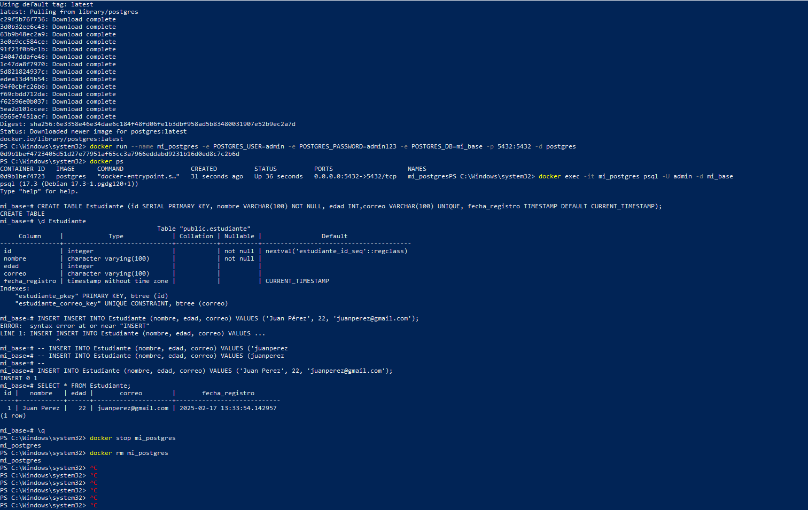

# Documentación de Proyecto: PostgreSQL en Docker

## Descripción

Este proyecto tiene como objetivo configurar un contenedor Docker con PostgreSQL y crear una base de datos con una tabla simple llamada `Estudiante`. Además, se insertan algunos datos y se consulta la tabla para verificar que todo funciona correctamente.

## Requisitos

- Tener Docker instalado en tu máquina.
- Tener acceso a la terminal o línea de comandos.

## Pasos

### 1. Levantar contenedor de PostgreSQL

Ejecutamos el siguiente comando para iniciar un contenedor Docker con PostgreSQL:

```bash
docker run --name mi_postgres -e POSTGRES_USER=admin -e POSTGRES_PASSWORD=admin -e POSTGRES_DB=mi_base -p 5432:5432 -d postgres
```

- `--name mi_postgres`: Establece un nombre para el contenedor.
- `-e POSTGRES_USER=admin`: Establece el usuario de PostgreSQL.
- `-e POSTGRES_PASSWORD=admin`: Establece la contraseña del usuario.
- `-e POSTGRES_DB=mi_base`: Establece el nombre de la base de datos.
- `-p 5432:5432`: Mapea el puerto 5432 del contenedor al puerto 5432 de la máquina host.
- `-d postgres`: Ejecuta el contenedor en segundo plano con la imagen de PostgreSQL.


Después de ejecutar este comando, podemos verificar que el contenedor está en funcionamiento con:

```bash
docker ps
```

Esto mostrará una lista de los contenedores activos. El contenedor `mi_postgres` debería estar en la lista.

### 2. Acceder a PostgreSQL dentro del contenedor

Para interactuar con la base de datos, usamos el siguiente comando:

```bash
docker exec -it mi_postgres psql -U admin -d mi_base
```

Esto nos conectará a la base de datos `mi_base` utilizando el usuario `admin`.


### 3. Crear la tabla Estudiante

Una vez dentro de PostgreSQL, creamos una tabla llamada `Estudiante` con el siguiente comando:

```sql
CREATE TABLE Estudiante (
  id SERIAL PRIMARY KEY,
  nombre VARCHAR(100) NOT NULL,
  edad INT,
  correo VARCHAR(100) UNIQUE,
  fecha_registro TIMESTAMP DEFAULT CURRENT_TIMESTAMP
);
```


### 4. Verificar la estructura de la tabla

Para verificar que la tabla se creó correctamente, utilizamos el comando `\d`:

```sql
\d Estudiante
```

Esto mostrará la estructura de la tabla `Estudiante`, incluyendo las columnas, tipos de datos y restricciones.

### 5. Insertar datos en la tabla

Insertamos un nuevo registro en la tabla `Estudiante` con el siguiente comando:

```sql
INSERT INTO Estudiante (nombre, edad, correo) VALUES ('Juan Perez', 22, 'juanperez@gmail.com');
```


### 6. Consultar los datos

Para verificar que los datos se han insertado correctamente, usamos la siguiente consulta:

```sql
SELECT * FROM Estudiante;
```

El resultado debería ser similar a este:

```sql
 id |   nombre   | edad |       correo        |       fecha_registro
----+------------+------+---------------------+----------------------------
  1 | Juan Perez |   22 | juanperez@gmail.com | 2025-02-17 13:33:54.142957
(1 row)
```


## Conclusión

Hemos logrado levantar un contenedor Docker con PostgreSQL, crear una base de datos, agregar una tabla y consultar los datos insertados. Ahora, puedes seguir extendiendo este proyecto para incluir más tablas y realizar consultas más complejas.

